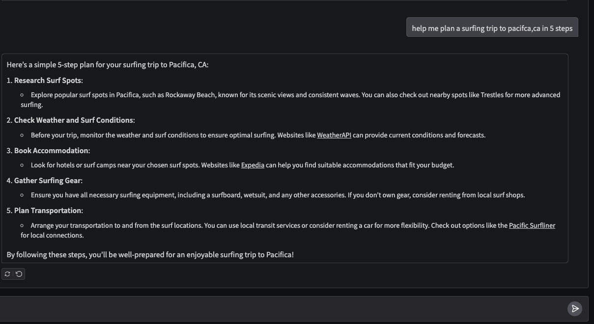

# research_agent
### By Keith Baskerville
This project is a simple AI-powered research assistant built with LangChain, LangGraph-style planning/execution, and Gradio.
It uses OpenAI for reasoning, Tavily for web search, and Wikipedia for factual lookups.

#### Features

- Breaks a user query into structured steps (planning with GPT-4o-mini).
- Chooses the right tool for each step (Wikipedia or Tavily search).
- Executes the plan and synthesizes a clear final answer.
- Chat interface powered by Gradio.

